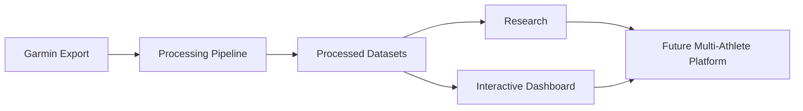
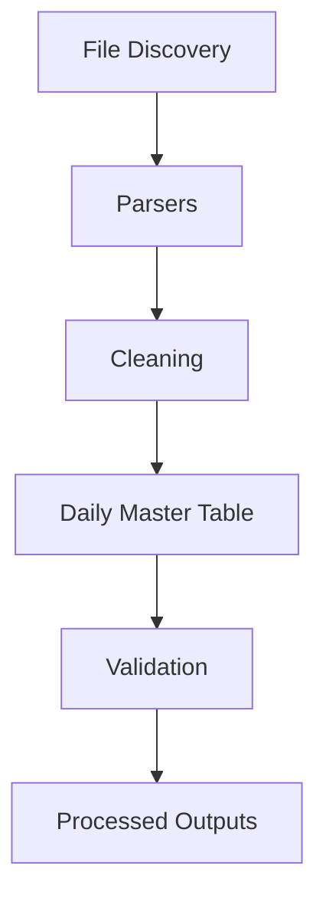

# Endurance Performance Project

A personal project for turning Garmin exports, marathon training history, and physiological signals into a reusable endurance analytics platform.

[](https://www.python.org/)
[](https://pandas.pydata.org/)
[](https://numpy.org/)
[](https://plotly.com/)
[](https://streamlit.io/)
[](https://endurance-analytics.streamlit.app)
[](https://github.com/)
[](https://github.com/)

**Dashboard:** https://endurance-analytics.streamlit.app

---

> **I wanted to understand what my own training history could actually teach me.**

---

## Project Overview

This project began as a simple question: what can I learn from my own Garmin data?

As a marathon runner and a data science student, I became interested in the way wearable systems quietly accumulate rich training signals over time. My Garmin exports were full of useful information, but it was scattered across fragmented JSON files and difficult to analyze as a coherent story. I started by trying to make sense of my own training history, and that curiosity gradually turned into a larger software project.

Today, the repository has three connected parts:

1. A reusable Garmin processing pipeline
2. Exploratory endurance analytics research
3. An interactive Streamlit dashboard

The goal is not just to analyze one season of training. It is to build a foundation for understanding longitudinal endurance performance with better structure, better tooling, and a clearer path toward broader multi-athlete analysis.

## Architecture





## Features

| Feature | What it does |
| --- | --- |
| ✔ Garmin export discovery | Finds and organizes Garmin JSON exports from raw data directories |
| ✔ Automated parsing | Converts fragmented Garmin exports into structured tabular data |
| ✔ Daily master table generation | Builds a unified daily dataset from training, readiness, and prediction signals |
| ✔ Marathon block analytics | Summarizes marathon training blocks and their evolving characteristics |
| ✔ Prediction analysis | Explores race prediction behavior, stability, drift, and volatility |
| ✔ Geographic visualization | Supports map-based views of training activity locations |
| ✔ Metadata generation | Tracks processing metadata and pipeline outputs |
| ✔ Modular architecture | Separates data ingestion, transformation, visualization, and app logic |
| ✔ Interactive dashboard | Offers an exploratory interface for longitudinal training analysis |

## Dashboard

I built a Streamlit-based dashboard to make the analysis more interactive and easier to explore. The app brings together marathon blocks, prediction evolution, physiological metrics, historical training volume, and exploratory visualizations in one place.

The dashboard currently focuses on:

- marathon blocks
- prediction evolution
- physiological metrics
- interactive maps
- historical training patterns
- summary statistics
- exploratory visualizations

A public deployment is planned, but this remains an active personal research and engineering project rather than a production product.

### Preview
A few snapshots of the current dashboard experience:

| Overview | Insights | Exploration |
| --- | --- | --- |
|  |  |  |

## Research

My exploratory analysis has centered on a few recurring themes in my own training history:

- Garmin race prediction behavior
- marathon prediction stability
- prediction drift and volatility
- HRV and readiness
- training load and recovery
- VO₂ Max trends
- marathon block summaries

### Current Findings

These findings are intentionally framed as exploratory observations from a single-athlete longitudinal case study. I am not making broad scientific claims from this work. Instead, I am using the project to ask careful questions about how wearable-derived predictions behave over time and how much signal can be recovered from a personal training archive.

Some of the patterns I have investigated include:

- prediction volatility that appears highly block-dependent
- periods of stabilization that occur earlier than expected in some marathon blocks
- the role of readiness and training load in shaping prediction behavior
- the need to account for data quality issues and fragmented export structures
- the importance of cleaning and standardizing wearable telemetry before analysis

## Repository Structure

```text
.
├── app/
│   ├── app.py
│   └── assets/
├── app.py
├── data_processed/
├── data_raw/
│   ├── all_garmin_data/
│   └── events_table.csv
├── dev_logs/
├── notebooks/
│   └── data_parsing/
│       ├── 01_parse_activities.ipynb
│       ├── 02_parse_metrics.ipynb
│       ├── 03_parse_race_predictor.ipynb
│       ├── 04_parse_training_readiness.ipynb
│       ├── 05_parse_max_met.ipynb
│       ├── 06_parse_training_history.ipynb
│       ├── 07_daily_master_table.ipynb
│       └── 08_prediction_analysis.ipynb
├── requirements.txt
├── src/
│   ├── charts.py
│   ├── formatting.py
│   ├── load_data.py
│   ├── maps.py
│   └── pipeline.py
└── README.md
```

## Tech Stack

| Layer | Tools |
| --- | --- |
| Programming | Python |
| Data manipulation | Pandas, NumPy |
| Visualization | Plotly, Streamlit |
| Data formats | JSON, Parquet |
| Version control | Git, GitHub |

## Quick Start

```bash
python -m venv .venv
source .venv/bin/activate
pip install -r requirements.txt
```

## Roadmap

### Completed

- Reusable Garmin pipeline structure
- Parsing of major Garmin export categories
- Daily master table construction
- Exploratory analysis of prediction behavior
- Interactive dashboard foundation

### In Progress

- Refining the data pipeline for broader reuse
- Improving dashboard usability and structure
- Strengthening data validation and metadata generation

### Planned

- Dashboard deployment
- Multi-athlete support
- More robust processing workflows

### Future Research

- Statistical modeling of endurance performance signals
- Predictive analytics around training and readiness
- Wearable validation studies
- Longitudinal performance modeling

## Why this project?

This project sits at the intersection of endurance sports, software engineering, data engineering, exploratory analysis, and wearable analytics. It is both a personal research environment and an end-to-end portfolio project that reflects how I think about building tools around messy, real-world data.

I care about the engineering details because the analysis only becomes useful when the data pipeline is structured well. I care about the sports context because the numbers only matter when they connect back to training, adaptation, and performance.

## Future Vision

My long-term goal is to expand this beyond my own data and build a more reusable platform that can support multiple athletes over time. I want to keep improving the infrastructure behind the project while continuing to ask careful questions about how training, recovery, prediction, and performance evolve together.

That vision is ambitious, but grounded. I am not claiming production readiness or universal scientific validity. I am building something I genuinely care about: a thoughtful, technically rigorous way to explore endurance performance through data.
